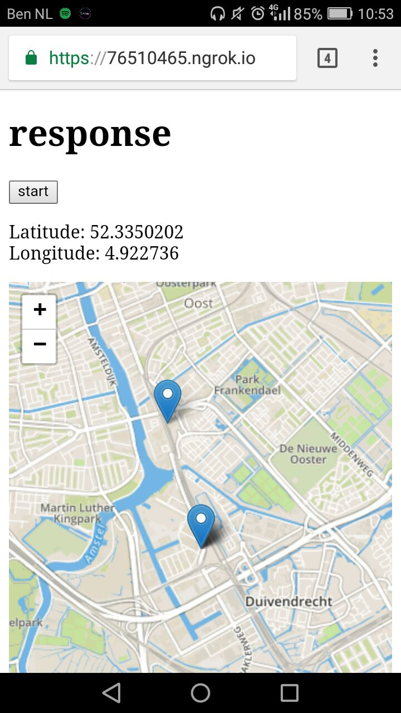

<h1 align="center">let's Meetup.</h1>

<div align="center">
  :globe_with_meridians::pushpin::bike: 
</div>
<div align="center">
  <strong>Readme for the redesign of the minor web website</strong>
</div>
<br />

-------


<div align="center"><em>Early Stage in development</em></div>

-------

## real-time-web-project

This is going to be an app that makes meeting up easier. To figure out what or which is the best for both users.


## Table of contents

## How to install
* First clone the repo :thumbsup:
* To install `npm install`
* to run in development `npm run dev`
* To start `npm start`
* the server listens to `localhost:7008`


## Features
_this moment:_ you can go to the application and be located on the app. When someone joins it will show on the map.

### how should this work.

You can create a room and invite your friends. When the friends join the room one of them (the person who created the room) can pin point a location. When the user have pinpointed a location the server suggests some locations around that point These locations will be stored in the database to make it easier for future events. When the user "locks in" a location the users will see the point. When the users reach a point the users can hit i'm there. So the other users know he/she is already there so they can see him/her.

## Services
* [Google Maps services](https://github.com/googlemaps/google-maps-services-js) - Google places API - Google route API
* [Leaflet.js](http://leafletjs.com/) - a mapbox
* [Socket.io](https://socket.io/)
* [Expressjs](https://expressjs.com/)
* [Mapbox](https://www.mapbox.com/) - The actual map

### But why

<br >

Well...,
* I use [Google Maps services](https://github.com/googlemaps/google-maps-services-js) package to run the services for the calculations and the google maps places API to look in the area of the pin to see new places.
* I use Leaflet to run the map view and edit the map easier (but after some testing i will probably use google maps).
* Map box i use mapbox right now to render the map.


_Bug: But the api of mapbox really doesn't like when multiple clients have the same key. it won't render it through Leaflet. Saying "it's already running"_


<!-- What external data source is featured in your project and what are its properties 🌠 -->

_for now:_ There is only a geolocations that is being pushed to the server.
It is logging the locations and will be done per user.

```
io.on('connection', (socket) => {
  // Socket Connection
  socket.on('geoLocation', (geoLocation) => {
    this shows you the geoLocation from the browser
    console.log(geoLocation);
  })
});
```


<!-- Where do the 0️⃣s and 1️⃣s live in your project? What db system are you using?-->

## @TODO
Because of this insane bad luck there is a stricter time constraint because a lot got messed up through this whole week. I really wanted to be way further in this project. I had to take a step back and had to redo my project multiple times. Which was detrimental to the time i had.

- [x] Get the Google api's i need for this project.
- [x] Read ALOT of docs (seriously, alot)
- [x] Started to draw how my application should work
- [x] research geolocation api
- [x] Had it working geolocation api
- [x] Use google maps geo location api to gather names
- [x] Computer went to repair.

#### Now we are here

- [ ] Getting the computer back from repair.
- [ ] Use google maps to show the map.
- [ ] Have the socket know which "dot" is who.
- [ ] Have an user name to pop up to a location.
- [ ] Socket.io Rooms.
- [ ] Google places API to get the locations near the "point" and suggest these.
- [ ] Remember the "chosen" locations.
- [ ] Now that we have the go to location create the path to that location.
- [ ] This can be Done with [Google Directions API ](https://developers.google.com/maps/documentation/directions/)

## License
[MIT](https://opensource.org/licenses/MIT)


<!-- Maybe a checklist of done stuff and stuff still on your wishlist? ✅ -->

<!-- How about a license here? 📜 (or is it a licence?) 🤷 -->
